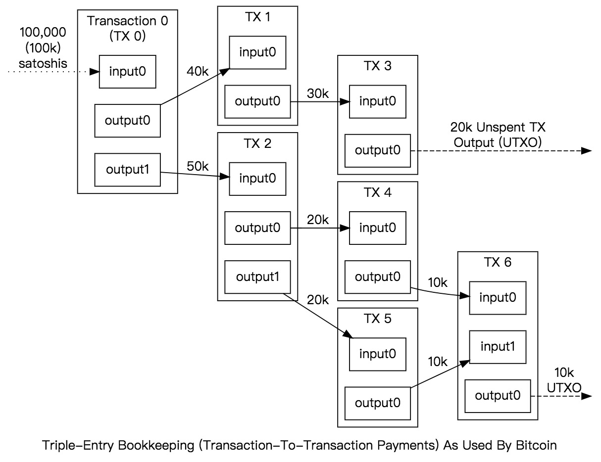
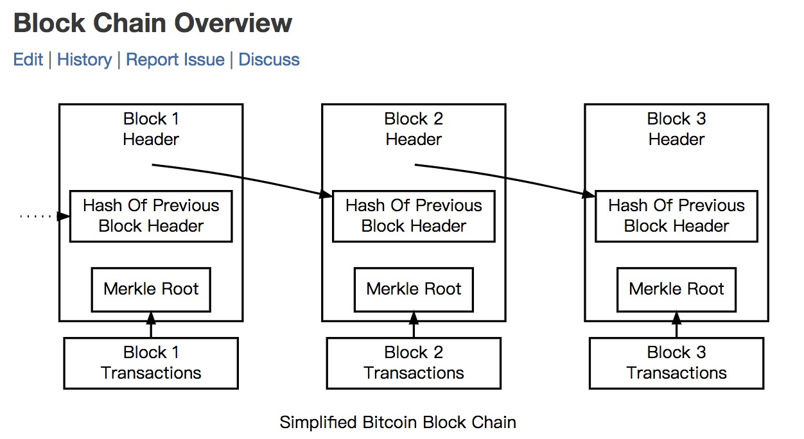
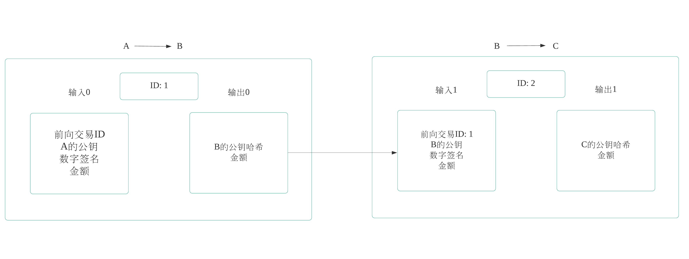
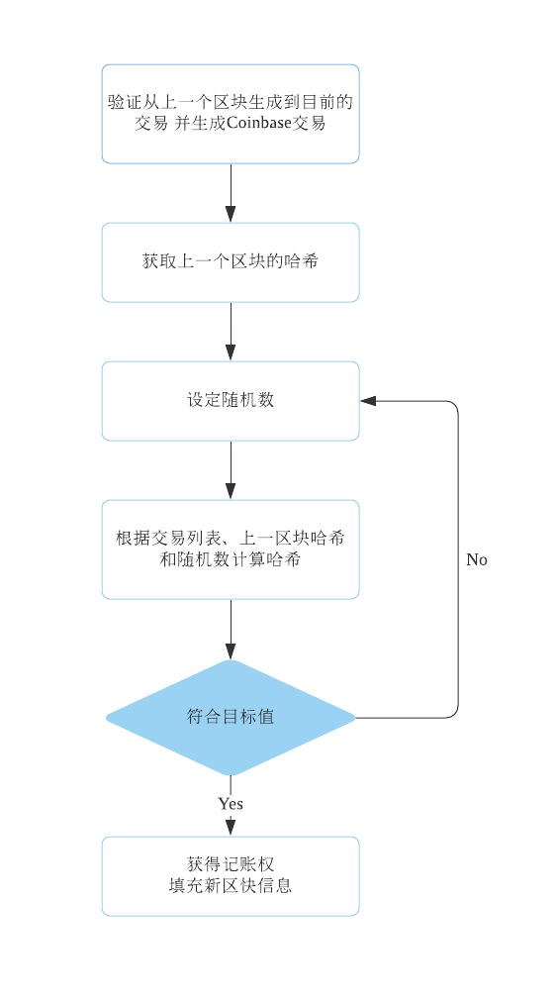

# **区块链的模拟实现**

**详情见 https://github.com/TeamFromNFLS/BlockChain**

[TOC]

---

## **选题背景意义**

### **选题原因**

区块链是一个分布式系统，并具有自身的 Token（有的翻译为“代币”）。区块链技术的地位和重要性不断提升，模拟实现区块链有助于理解前沿技术。在政策端，2019 年 1 月 10 日，国家互联网信息办公室发布《区块链信息服务管理规定》；2019 年 10 月 24 日，在中央政治局第十八次集体学习时，习近平总书记强调，“把区块链作为核心技术自主创新的重要突破口”和“加快推动区块链技术和产业创新发展”。在应用端，区块链在金融交易、物联网、公共服务、数字版权等领域应用广阔；特别是数字货币，已经产生大量的投资和商用案例。

### **理论意义**

- P2P 网络

  P2P 网络和节点发现，同 23 步区块等有关，属于区块链的底层模块。

- 哈希算法

  哈希算法是一种数据映射关系，为方便表述，将其记为 $h = Hash(S |x)$, 其中 $x$ 为映射前数据，$S$ 为 $x$ 可选数据的集合，$h$ 为 $x$ 的哈希值。哈希算法具有如下特点：

  1. 无法根据 $h$ 推导出 $x$
  2. 已知 $h$, 若想要得到 $x$, 只能暴力枚举
  3. 对于任意 $x$， 改动非常小的信息量也会得到截然不同的 $h$
  4. 对于任意的 $x' \neq x$, $Hash(x') \neq Hash(x)$

  哈希算法在区块链中的应用包括：

  1. 生成区块（挖矿）
  2. Merkle tree
  3. 生成及验证交易
  4. 计算节点地址
  5. 实现数据不可篡改性

- 共识机制

  基于区块链分布式账本的背景，共识机制主要用来解决

  1. 谁有权利记账
  2. 如何防止作弊

  区块链项目中比较成熟且应用广泛的机制是 PoW，即工作量证明。针对第一个问题，其核心是利用计算不对称性：提出一个计算难题，但是验证这个难题的答案非常容易，而 PoW 采取的计算难题就是算出符合条件的哈希值。至于第二个问题，PoW 的策略是让作弊的成本远大于收入。一方面由于哈希算法的特点，获得记账权的唯一决定因素就是算力；另一方面记账的人也会获得奖励。如果想要作弊，需要投入大量的算力，而这种成本往往小于作弊得到的收益和诚实记账获得的奖励。

- 加密算法

  区块链中主要采用非对称加密，即加密解密需要的密钥不同，并且公钥可以公开。非对称加密将用于交易的生成和验证。

- 交易模型

  区块链主要有两种交易模型： 账户余额模型和 Unspent Transaction Output (UTXO) 。前者主要用于智能合约型区块链，不是本项目模拟的重点，故不作介绍。UTXO 用于数字货币型区块链，其记录的不是交易的结果，而是交易的状态。任何一笔交易都需要满足：

  1. 至少有一个输入和一个输出
  2. 输入的金额必须全部使用

### **实践意义**

数字货币是区块链的一大应用方向。数字货币的分布式账本有别于传统的央行-商业银行的模式，其与传统货币的区别概括如下：

| 传统货币                           | 数字货币                                                                                         |
| ---------------------------------- | ------------------------------------------------------------------------------------------------ |
| 实名制：或多或少保留了交易者信息   | 化名性                                                                                           |
| 中心化                             | 点对点                                                                                           |
| 托管型安全性：安全性依赖于中心机构 | 自理型安全性：只要加密算法不被攻破，历史交易记录就不会丢失或被篡改；各节点用户也只需要保护好私钥 |
| 主权国家内部流通                   | 广区域流通                                                                                       |

区块链的模拟将对照和佐证密码学等理论，实现数字货币的部分功能交易、记账等功能。同时，在模拟实现功能中了解区块链的技术，也将进一步促进对“去中心化”，“量子威胁”，“CAP”等概念的思考。

---

---

## **同类软件调研分析**

---

- 以区块链为基础的商用案例以比特币为代表，同时还有以太坊，XRP 等：

****

比特币于 2009 年发布，预计挖矿可以持续到 2140 年。比特币的特点是区块链特点的集中体现，包括点对点，广域流通等等。但是，同大多数数字货币一样，比特币的不足也十分明显：交易确认时间长、价格波动极大、无法对经济冷暖进行调控等等。





技术层面上，以下列举了比特币采用的算法/模型：

| **非对称加密** | **哈希**算法 | **共识机制** |           **交易模型**            |
| :------------: | :----------: | :----------: | :-------------------------------: |
| 椭圆曲线 ECDSA |    SHA256    |     PoW      | Unspent Transaction Output (UTXO) |

此外，比特币还设有难度系数动态调节机制以确保生成区块平均所需时间为 10 分钟

- 本次作业模拟实现的区块链相较于现实中的区块链在具体实现上有所不同，同时也根据个人能力和需求进行了简化。具体而言：
  - 比特币在加密算法上选择椭圆曲线，但本次项目选择 1024 位大质数 RSA 加密（目前已实现大数库封装，详情见 /Project/bigInteger）
  - 简化 p2p 网络，改用静态节点共同维护交易池的方式模拟节点广播等操作
  - 简化 UTXO，目前仅打算实现单链 UTXO（i.e.交易输入和输出均为单个），同时用对象模拟锁定脚本

## **功能设计**

### **加密算法**

#### **RSA**

##### **大数类**

- （参考项目https://github.com/thuliangjz/rsa-DIY）

1. 2^64 进制存储数据，减少位数

2. 加减乘法汇编加速，一次可以处理多位数字与进位溢出问题

   - 理论上处理器支持 128 位寄存器，可以进一步扩大进制

   - 加法每次即每次从寄存器`EFLAGS`中读取上一次相加所得进位，用`adc`指令将数和上一次进位`CF`相加，保存进位增加索引进入下一轮相加，核心代码如下：

   ```asm
    sahf;
    movq (%%r8, %%rcx, 8), %%rax;
    movq (%%r9, %%rcx, 8), %%rbx;
    adc %%rax, %%rbx;
    lahf;
    movq %%rbx, (%%r10, %%rcx, 8);
   ```

   - 减法即将`adc`改为`sub`即可

   - 乘法模拟竖式，先将一个乘数中的某一个整型乘以另一个大整数，移位后加到最终结果上。第一步代码如下：

   ```asm
    mov %%r8, %%rax;	//小乘数保存在r8中
    mov (%%rsi, %%rcx, 8), %%rbx;	//取出大乘数
    mul %%rbx;
    mov %%rax, %%rbx;
    ASM_RESTORE
    adc %%r14, %%rbx;	//本轮结果即本次乘法+上次乘法溢出+上次加法溢出
    ASM_LOAD
    mov %%rdx, %%r14;	//mul指令溢出保存在r14中
    mov %%rbx, (%%rdi, %%rcx, 8);
   ```

   - 除法为长除法。这里实现的实际上是基于二进制的整形除法，每次确定商的一个比特位。长除法中的乘法全部被移位所替代，因为每次除数需要乘的都是 2 的幂次，这在一定程度上加快了除法的速度

3. 快速幂借助 Newton-Raphson 算法，用乘法和加减法代替除法。用定点数存储，以调用之前的整数运算实现小数运算

   - 精度问题在原项目中有详细分析，摘抄如下

     - 关于定点数的精度，对于计算 $a^b \pmod{n}$，在使用快速幂算法进行迭代计算的过程中，每一步实际上都是对于某个$x \le n$计算$x^2 \pmod n$，所以实际上被除数不大于$n^2$。如果$n$有$p$位，则$n^2$不超过$2p$位，从而对于这样的$x^2$，逆的精度只要精确到小数点后$2p$位即误差不超过$2^{-2p}$即可保证与被除数相乘与商的误差不超过 1。
     - 注意到如果将$\lfloor \frac 1n \times x \rfloor $作为商，即使误差本身不超过 1，向下取整之后可能会达到 1（向下取整在这里实现为移位运算），从而按上述方法计算的结果可能需要减去 n 才能得到真正比 n 小的余数。

##### **验证质数**

1. 采用方案：Miller-Rabin 检测（伪代码）

   Miller-Rabin 素性检验是一个基于概率的检验方案，与费马素性检验相比条件更强，更不易出现类似 Carmichael 数一类的漏网之鱼；而 AKS 素性检验可以确定地判断给定数字是否为素数，但是速度相较 Miller-Rabin 更慢。

   该素性检验的主要思想为：

   待检验的数为 $n$ （$n$为奇数）， 将 $n-1$ 分解为 $2^r \cdot d$, 其中 $d$ 为奇数。若$\exists \; a \in [2, n-2], \; a\in \mathrm{N}\; s.t. \forall 0 \leq s \leq r-1,\; a^d \not\equiv 1(mod\;n)\;\text{且}\;a^{2^sd} \not\equiv n-1(mod \; n),$则$n$为合数。通过$k$轮检验($i.e.\;k$ 次随机选取$a$)。以下为该检验方法的伪代码：

   write $n-1$ as $2^r \cdot d$ by factoring powers of $2$ from $n-1$

   Loop: repeat $k$ times:

    pick a random integer $a\in [2, n-2]$

    $x \leftarrow\;a^d \; mod\; n$

    if $x = 1$

    then continue Loop

    repeat $r$ times:

    if $x = n-1$

    then continue Loop

    $x \leftarrow\; x^2\;mod\;n$

    return composite

   return probably prime

   参考密码学资料以及 Java 的 RSA 库，为了平衡效率和正确率，1024 位 RSA 将选取$k=4$.

##### **RSA 实现**

- RSA 生成公私钥的步骤如下

  1. 任选两个 512 位素数$p, q$, 计算其积为$N$
  2. 计算欧拉数$e = (p-1)\cdot (q-1)$
  3. 任选 $e$ 满足 $1<e<N$ 且 $gcd(e, N) = 1$, $(e, N)$即为公钥。实际应用中 $e$ 大多选择 $3$ 或 65537
  4. 任选 $d$ 满足 $1<d<N$ 且 $e\cdot d \equiv 1(mod\; N)$, $( d, N)$即为私钥。

  在步骤 a. 中，为了加快素数生成速度，先随机生成一个奇数 $n$, 取以 $n$ 为首项的 1000 个连续奇数，用小于 10000 的素数筛一遍，剩下的数用 Miller-Rabin 素性检验进行检测，如果不存在素数，则重复上述过程。

  在步骤 d. 中，采用扩展欧几里得算法计算 $d\; mod \; N$ 的逆元。

- RSA 加解密

  - 公钥加密，私钥解密

    $\text{密文} = \text{明文}^e \; mod \; N$

    $\text{明文} = \text{密文}^d\;mod\;N$

  - 私钥加密，公钥解密（用于交易中的数字签名及验证，详细介绍见后文）

    $\text{密文} = \text{明文}^d \; mod \; N$

    $\text{明文} = \text{密文}^e\;mod\;N$

### **哈希算法**

#### **SHA256**

- 摘抄自[sha256](http://www.zedwood.com/article/cpp-sha256-function)，这就不重复造轮子了

### **p2p 网络**

#### **共享内容**

##### **公钥池**

- 由于没有实现真正的 p2p 网络，因此需要公钥池存储所有节点的公钥

##### **交易池**

1. 交易池内存储所有交易记录（打包进区块链的和等待矿工打包的）

2. 交易记录：

   - 交易结构

   1. 交易 ID：本次交易的编号

   2. 交易输入：交易的发起者信息

      1. 交易 ID：依赖交易

         若交易对象

      2. 发起者公钥

      3. 发起者数字签名

      4. 金额

   3. 交易输出：交易对象信息

      1. 交易对象公钥哈希
      2. 金额

      特别地，在 Coinbase 交易（i.e. 挖矿获得奖励）中，不存在交易输入。

   - UTXO 模型

     
     - 交易2中，B使用了交易1中输出0指向的代币，即输入1中交易2的前向交易为交易1
     - 交易2中，C还没有产生新的交易，即输出1还没有被花费，即未花费的交易输出(UTXO)


##### **区块链**

##### **添加新节点**

1. 生成地址，将公钥发送到公钥池中
2. 同步区块链
3. 验证区块链完整性（梅克尔树）

#### **节点**

##### **普通节点（钱包）**

1. 钱包地址生成

   1. 从随机数库中随机挑选 privatekey

   2. RSA 计算 publicKkey

      （通过 RSA 得到公钥和私钥）

   3. 对 publickey 进行 sha256 散列和 ripemd160 散列得到 publickeyHash

   4. 在 publickeyHash 头添加 version 字节得到 versionPublickeyHash

   5. 对 versionPublickeyHash 进行两次 sha256 散列取前四位字节得到 tailHash

   6. 在 versionPublickeyHash 尾添加 tailHash 得到 finalHash

   7. 对 finalHash 进行 Base58 编码得到地址

2. 交易生成广播

   1. 查询足够本次交易的 UTXO
      1. 遍历交易池得到 sender 为当前发起者地址的交易（i.e. 这些交易花费了之前生成的 UTXO），将这些交易所依赖的交易（i,e. 交易输入中的 ID）记录到 setA 中
      2. 遍历区块链，排除 setA 中所有已经打包的交易，剩下即为可以依赖的交易
   2. 生成交易记录发送进交易池，等待矿工检验并打包完成交易（此时默认 UTXO 已经花费，避免二次支付）

3. 查询本钱包地址余额（回溯区块链中交易）

##### **矿工节点（继承普通节点）**

1. 打包交易池中交易进区块链（工作量证明）

   

2. 验证交易信息
   1. 地址和公钥是否相符
   2. 公钥和数字签名是否相符
3. 验证区块
   1. 验证工作量证明：是否小于目标值
   2. 验证梅克尔树树根
   3. 验证是否只有一个挖矿奖励交易
   4. 验证所有交易是否合法

### **区块链**

#### **区块头**

| **字段**         | **大小** | **描述**                           |
| ---------------- | -------- | ---------------------------------- |
| version          | 4 字节   | 版本号，⽤于跟踪软件/协议的更新     |
| prevBlockHash    | 32 字节  | 上一个区块的 Hash 地址             |
| merkleRoot       | 32 字节  | 该区块中交易的 merkle 树根的哈希值 |
| time             | 4 字节   | 该区块的创建时间戳                 |
| difficultyTarget | 4 字节   | 该区块链工作量证明难度目标         |
| nonce            | 4 字节   | 用于证明工作量的计算参数           |

#### **区块体**

| **字段**             | **大小**   | **描述**               |
| -------------------- | ---------- | ---------------------- |
| numTransactionsBytes | 1 字节     | 交易数量占用的字节数   |
| numTransactions      | 0-8 个字节 | 区块内存储的交易数量   |
| transactions         | 不确定     | 区块内存的多个交易数据 |
